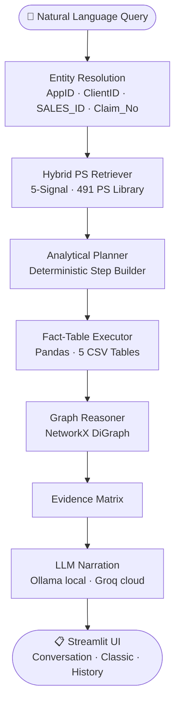

# 📊 ExcelSense

**Ask plain-English questions over structured tabular data — get deterministic, fact-grounded answers with LLM narration.**

[](https://python.org)
[](https://streamlit.io)
[](https://ollama.ai)
[](#license)

---

## 🔍 Problem Statement

Business analysts working with structured datasets (CSV/Excel) are stuck writing SQL or Python for every question. Existing BI tools require training and don't reason across multiple joined tables. ExcelSense bridges the gap: ask a question in natural language, get a precise, data-grounded answer backed by deterministic computation — no hallucinated numbers.

---

## 💡 Solution Overview

ExcelSense maps a natural language query to a **Problem Statement library** of 491 pre-mapped analytical patterns, executes 100% deterministic Pandas aggregations across 5 joined tables, and optionally polishes the result with an **LLM** for an executive narrative. Runs fully locally via Ollama, or on Streamlit Cloud via the Groq API — zero code changes needed.

---

## ⚡ Key Features

- 🗣️ **Conversation Mode** — follow-up questions with context retention
- 📊 **Classic Dashboard** — single-shot structured analytics
- 🔢 **Deterministic Answers** — every number computed from raw CSVs, never hallucinated
- 🔗 **Graph Reasoning** — NetworkX DiGraph across policies, owners, agents, claims
- 🧠 **Hybrid 5-Signal Retriever** — lexical + semantic + concept + analytical + prior signals
- 🤖 **Dual LLM Backend** — local Ollama (`qwen2.5:14b`) or Groq cloud (`llama-3.3-70b`) auto-selected
- 💾 **Persistent Query History** — all results cached locally in JSON
- 🚫 **491 Problem Statements** — 445 answerable; 46 explicitly flag unsupported gaps

---

## 🏗️ System Architecture



---

## 🛠️ Tech Stack

| Layer | Technology |
|---|---|
| UI | Streamlit |
| Retrieval | Custom 5-Signal Hybrid Retriever |
| Analytics | Python · Pandas |
| Graph Reasoning | NetworkX |
| Local LLM | Ollama (`qwen2.5:14b`) · Groq (`llama-3.3-70b`) |
| Persistence | JSON (local) |
| Testing | Python `unittest` |

---

## 📂 Project Structure

```
ExcelSense/
├── app.py                          # Entry point (Streamlit)
├── src/
│   ├── analytics/
│   │   ├── analytics_core.py       # Deterministic aggregation engine
│   │   └── graph_engine.py         # NetworkX reasoning layer
│   ├── retrieval/
│   │   └── business_retrieval.py   # Hybrid 5-signal PS retriever
│   └── llm/
│       └── ollama_client.py        # Local Ollama integration
├── ui/
│   ├── business_dashboard.py       # Classic dashboard mode
│   └── chat_dashboard.py           # Conversation mode
├── data/
│   ├── csv/                        # 5 production CSV tables
│   ├── problem_statements/         # 491 PS definitions (JSON)
│   └── history/                    # Persistent query cache
├── builders/                       # PS migration & schema tools
└── tests/                          # Deterministic validation suite
```

---

## 🚀 Quick Start

**Prerequisites:** Python 3.10+, [Ollama](https://ollama.ai) running locally with `qwen2.5:14b` pulled.

```bash
git clone https://github.com/SwayamAg/ExcelSense.git
cd ExcelSense
pip install -r requirements.txt
streamlit run app.py
```

Open **http://localhost:8501** in your browser.

> **LLM narration** auto-selects the best available backend:
> - Local Ollama running? → uses `qwen2.5:14b` automatically
> - No Ollama? → add `GROQ_API_KEY` to `.env` (see [LLM Configuration](#-llm-configuration) below)

---

## 🔑 LLM Configuration

ExcelSense picks the LLM backend automatically — **Ollama first, Groq fallback**.
Deterministic answers always work even with no LLM configured.

### Running locally (`.env`)

Copy `.env.example` → `.env` and fill in your key:

```bash
cp .env.example .env
```

```ini
# .env
GROQ_API_KEY=gsk_your_key_here        # from https://console.groq.com (free)
# GROQ_MODEL=llama-3.3-70b-versatile  # default — same architecture family as qwen2.5
# OLLAMA_URL=http://localhost:11434    # default Ollama address
# OLLAMA_MODEL=qwen2.5:14b            # override local model
```

> `.env` is gitignored — it is **never committed**.

### Streamlit Community Cloud

Go to your app → **Settings → Secrets** and paste:

```toml
GROQ_API_KEY = "gsk_your_key_here"
```

A template is at [`.streamlit/secrets.toml.example`](.streamlit/secrets.toml.example).

### Backend priority

| Situation | LLM used |
|---|---|
| Ollama running locally | `qwen2.5:14b` (or auto-detected model) |
| Ollama offline + `GROQ_API_KEY` set | `llama-3.3-70b-versatile` via Groq |
| Neither configured | Deterministic answer only (no narration) |

---

## 💬 Example: Conversation Mode

Conversation mode retains context across follow-up questions.

**Turn 1**
```
User  ▶  Which state has the highest lapse rate?

Agent ▶  Maharashtra leads with a lapse rate of 34.2% (13th-month bucket),
         based on 6,821 policies due for renewal in that cohort.
```

**Turn 2 — follow-up**
```
User  ▶  Break that down by payment mode.

Agent ▶  Maharashtra 13th-month lapse by payment mode:

         Payment Mode   | Policies Due | Lapsed | Lapse Rate
         ---------------|-------------|--------|----------
         Cheque         |        2,104 |    821 |    39.0%
         Online-UPI     |        2,310 |    712 |    30.8%
         ECS            |        1,198 |    384 |    32.1%
         Credit Card    |          897 |    198 |    22.1%
         Cash           |          312 |    108 |    34.6%
```

**Turn 3 — pivot**
```
User  ▶  Now show me the top 3 agents in Maharashtra by APE.

Agent ▶  Top 3 agents in Maharashtra by Annual Premium Equivalent:

         Rank | SALES_ID  | APE (₹)     | Policies
         -----|-----------|------------|--------
            1 | SL-004821 | ₹18,45,200 |      94
            2 | SL-002017 | ₹16,92,500 |      87
            3 | SL-008834 | ₹15,10,800 |      79
```

---

## 📋 Example: Classic Dashboard Mode

Single-shot analytical queries — no conversation context.

**Input**
```
What is the 25th-month persistency rate for term plans sold via Banca channel?
```

**Output**
```
Persistency Rate (25th Month · Term Plans · Banca)
───────────────────────────────────────────────────
Policies in 25th-month cohort : 8,204
Renewed on time               : 6,891
Persistency Rate              : 83.99%

Note: All 25,000 policies are Banca / Annually — channel breakdown
      is a single-row result by design, not a comparison.
```

---

## 🗂️ Dataset Overview

5 production CSVs in `data/csv/`:

| Table | Rows | Key | Purpose |
|---|---|---|---|
| `Policy_Details.csv` | 25,000 | `AppID` | Sum Assured, APE, plan, status |
| `Owner_Details.csv` | 25,000 | `AppID`, `ClientID` | Demographics, state, income |
| `Persistency_Details.csv` | 24,542 | `AppID` | Renewal status, payment mode, bucket |
| `Sales_Details.csv` | 1,956 | `SALES_ID` | Agent compliance, PIVC, RCU flags |
| `Claims_Details.csv` | 134 | `Claim_No` | Death claims, TAT, amount paid |

> Full data dictionary: `data/Talk_to_Data_PoC_Documentation_Metadata_V4.docx`

---

## ⚠️ Limitations

- **Single domain**: Grounded to the 5 tables above; external data not supported.
- **46 unsupported PS**: Queries on smoker status, riders, surrender reason, or outreach channel return an explicit gap message rather than empty results.
- **Banca / Annual only**: All policies share a single channel and payment frequency — cross-channel breakdowns return one row by design.
- **LLM optional**: No LLM configured → deterministic answers display without narration. Set `GROQ_API_KEY` for cloud narration, or run Ollama locally.
- **459 policies** have no persistency record — all persistency rates are computed over 24,542 records, not 25,000.

---

## 🔭 Roadmap

- [ ] Multi-domain CSV support (upload your own tables)
- [ ] Docker containerisation
- [ ] Voice input via Whisper
- [ ] Export answers to PDF / Excel
- [ ] Agent memory across sessions
- [ ] REST API layer (FastAPI)

---

## 🧪 Running Tests

```bash
python -m unittest tests/test_business_analytics.py
```

✅ 18/18 tests pass deterministically.

---

## 👤 Author

**Swayam Agarwal**
[](https://github.com/SwayamAg)

---

## 📄 License

MIT License — see [LICENSE](LICENSE) for details.
